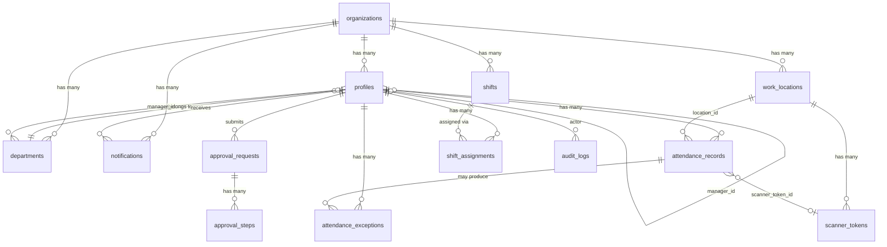

# Taptu — Logical ERD

All tables live in the `public` schema on Supabase (PostgreSQL).
Row-level security is enabled on all tables. The Express API uses the service role key server-side.

Fields marked **[intended]** do not yet exist in migrations but represent planned additions.
Fields marked **[optional/future]** are not planned for the near term.

---

## Entity Overview

---

## Entities

### `organizations`
Single workspace/company unit. All data is scoped to an organization.

| Field | Type | Notes |
|-------|------|-------|
| `id` | uuid PK | |
| `name` | text | Company/workspace name |
| `created_at` | timestamptz | |

---

### `profiles`
Extends Supabase `auth.users`. One profile per authenticated user.

| Field | Type | Notes |
|-------|------|-------|
| `id` | uuid PK | References `auth.users.id` |
| `full_name` | text | |
| `email` | text unique | |
| `role` | text | `superadmin`, `admin`, `manager`, `employee`, `scanner` |
| `organization_id` | uuid FK → organizations | |
| `department_id` | uuid FK → departments | Nullable |
| `manager_id` | uuid FK → profiles | Self-ref; Manager who oversees this employee |
| `position` | text | Nullable job title |
| `employee_code` | text | Nullable HR code |
| `created_at` | timestamptz | |

**Key relationship:** `profiles.manager_id` is how manager team scoping works. Manager sees employees where `profiles.manager_id = manager.id`.

---

### `departments`
Organizational unit within a workspace.

| Field | Type | Notes |
|-------|------|-------|
| `id` | uuid PK | |
| `organization_id` | uuid FK → organizations | |
| `name` | text | |
| `manager_id` | uuid FK → profiles | Nullable; who manages this department |
| `description` | text | Nullable |
| `is_active` | boolean | Default true |
| `created_at` / `updated_at` | timestamptz | |

---

### `work_locations`
Physical locations with GPS boundaries for attendance validation.

| Field | Type | Notes |
|-------|------|-------|
| `id` | uuid PK | |
| `organization_id` | uuid FK → organizations | |
| `name` | text | e.g. "Kantor Pusat" |
| `latitude` | double precision | |
| `longitude` | double precision | |
| `radius_meters` | int | Geofence radius; default 150m |
| `created_at` / `updated_at` | timestamptz | |

---

### `shifts`
Work schedule definition.

| Field | Type | Notes |
|-------|------|-------|
| `id` | uuid PK | |
| `organization_id` | uuid FK → organizations | |
| `name` | text | e.g. "Shift Pagi" |
| `start_time` | time | |
| `end_time` | time | |
| `late_threshold_minutes` | int | Grace period before marking late; default 15 |
| `created_at` / `updated_at` | timestamptz | |

---

### `shift_assignments`
Maps an employee to a shift for a given effective date. Unique per `(employee_id, effective_date)`.

| Field | Type | Notes |
|-------|------|-------|
| `id` | uuid PK | |
| `employee_id` | uuid FK → profiles | |
| `shift_id` | uuid FK → shifts | |
| `effective_date` | date | Date assignment takes effect |
| `created_at` | timestamptz | |

---

### `scanner_tokens`
Active QR tokens for scanner/kiosk validation. Tokens rotate on expiry.

| Field | Type | Notes |
|-------|------|-------|
| `id` | uuid PK | |
| `token` | text unique | Short alphanumeric QR token |
| `work_location_id` | uuid FK → work_locations | Nullable on delete |
| `status` | text | `active`, `expired`, `invalidated` |
| `expires_at` | timestamptz | Rolling expiry (~30 seconds) |
| `scans_today` | int | Daily scan counter |
| `created_at` / `updated_at` | timestamptz | |

---

### `attendance_records`
One row per employee per day. Unique on `(employee_id, attendance_date)`.

| Field | Type | Notes |
|-------|------|-------|
| `id` | uuid PK | |
| `employee_id` | uuid FK → profiles | |
| `shift_id` | text | Shift reference (text for backward compat) |
| `check_in_time` | timestamptz | Nullable until check-in |
| `check_out_time` | timestamptz | Nullable until check-out |
| `status` | text | `Belum check-in`, `Tepat waktu`, `Terlambat`, `Selesai` |
| `state` | text | `idle`, `checked_in`, `checked_out` |
| `location_id` | uuid FK → work_locations | Nullable |
| `location_lat` / `location_lng` | double precision | Captured GPS at check-in |
| `validation_status` | text | `verified`, `needs_review`, `blocked`, `rejected`, `corrected` |
| `validation_reasons` | text[] | Human-readable validation failure reasons |
| `selfie_url` | text | Nullable; URL to stored selfie proof |
| `device_id` | text | Nullable; device fingerprint |
| `scanner_token_id` | uuid FK → scanner_tokens | Nullable; evidence of QR scan |
| `attendance_date` | date | Default current date |
| `created_at` / `updated_at` | timestamptz | |

---

### `attendance_exceptions`
Created when an attendance record has `validation_status = needs_review`. Queued for Manager/HR review.

| Field | Type | Notes |
|-------|------|-------|
| `id` | uuid PK | |
| `attendance_record_id` | uuid FK → attendance_records | |
| `employee_id` | uuid FK → profiles | |
| `exception_type` | text | `Outside radius`, `Late check-in`, `Missing checkout`, `Invalid QR`, `Expired QR`, `Different device`, `Missing selfie`, `Selfie issue` |
| `reason` | text | Human-readable description |
| `status` | text | `Need Review`, `Approved`, `Rejected`, `Request Correction` |
| `admin_note` | text | Nullable; reviewer note |
| `reviewed_by` | uuid FK → profiles | Nullable |
| `reviewed_at` | timestamptz | Nullable |
| `created_at` | timestamptz | |

---

### `approval_requests`
Leave, permission, or attendance correction requests submitted by employees.

| Field | Type | Notes |
|-------|------|-------|
| `id` | uuid PK | |
| `employee_id` | uuid FK → profiles | |
| `request_type` | text | `Izin`, `Cuti`, `Sakit`, `Permission`, `Attendance Correction`, `Forgot Check-in/out` |
| `start_date` / `end_date` | date | |
| `title` | text | Short description |
| `reason` | text | Detail |
| `status` | text | `Menunggu`, `Disetujui`, `Ditolak` (legacy single-step) |
| `current_step` | int | Current approval step number (multi-step) |
| `final_status` | text | `pending`, `approved`, `rejected`, `cancelled` |
| `completed_at` | timestamptz | Nullable |
| `admin_note` | text | Nullable |
| `reviewed_by` | uuid FK → profiles | Nullable |
| `reviewed_at` | timestamptz | Nullable |
| `created_at` | timestamptz | |

---

### `approval_steps`
Individual steps in the approval chain for a request. One row per step per request.

| Field | Type | Notes |
|-------|------|-------|
| `id` | uuid PK | |
| `request_id` | uuid FK → approval_requests | |
| `step_order` | int | 1 = Manager, 2 = HR Admin |
| `approver_role` | text | Expected role for this step |
| `approver_id` | uuid FK → profiles | Nullable; specific approver if pre-assigned |
| `status` | text | `pending`, `approved`, `rejected`, `skipped`, `cancelled` |
| `note` | text | Nullable; reviewer comment |
| `reviewed_at` | timestamptz | Nullable |
| `created_at` / `updated_at` | timestamptz | |

Unique on `(request_id, step_order)`.

---

### `notifications`
In-app inbox notifications sent to specific users after events (check-in exception, request update, approval decision).

| Field | Type | Notes |
|-------|------|-------|
| `id` | uuid PK | |
| `organization_id` | uuid FK → organizations | |
| `recipient_id` | uuid FK → profiles | |
| `recipient_role` | text | Nullable; role context |
| `type` | text | Notification type key |
| `title` | text | Short headline |
| `message` | text | Full message body |
| `entity_type` | text | Nullable; e.g. `attendance_exception`, `approval_request` |
| `entity_id` | text | Nullable; ID of the related entity |
| `read_at` | timestamptz | Nullable; null = unread |
| `created_at` | timestamptz | |

---

### `audit_logs`
Immutable log of important actions. Append-only; not updated or deleted.

| Field | Type | Notes |
|-------|------|-------|
| `id` | uuid PK | |
| `actor_id` | uuid FK → profiles | Nullable (system actions) |
| `actor_role` | text | Role of actor at time of action |
| `action` | text | Action key, e.g. `checkin`, `approval_request_approved` |
| `target_id` | text | ID of the affected entity |
| `detail` | text | Human-readable summary |
| `created_at` | timestamptz | |

---

## Legacy / Deprecated Tables

These tables exist from early migration phases and are kept for backward compatibility. The API primarily uses the newer tables above.

| Table | Status | Replaced by |
|-------|--------|-------------|
| `attendance` | Deprecated | `attendance_records` |
| `requests` | Deprecated | `approval_requests` |
| `scanner_state` | Deprecated | `scanner_tokens` |
| `taptu_app_store` | Demo-only KV store | Not used in production |
