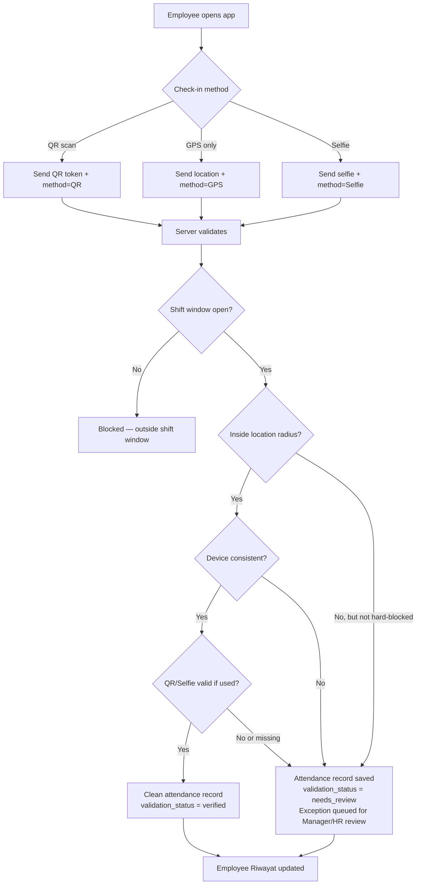

# Taptu — User Flow

**Product:** Attendance Validation OS for operational teams.
**Not:** a full HRIS, payroll engine, or recruitment platform.

---

## A. Workspace Setup Flow

```
Public registration (Superadmin only)
  └─ Superadmin creates workspace + first account
       └─ Superadmin/Admin HR creates internal accounts from dashboard:
            - Admin HR
            - Manager (assigned to department)
            - Employee (assigned to department + shift + work location)
            - Scanner/Kiosk
       └─ Admin HR configures:
            - Departments
            - Work locations (GPS coordinates + radius)
            - Shifts (start time, end time, late threshold)
            - Shift assignments per employee
```

**Employee can only check in after:**
1. Account created by Admin HR or Superadmin
2. Assigned to a department
3. Assigned to a shift
4. Assigned to a work location

---

## B. Daily Attendance Flow



**Validation checks (server-side, in order):**
1. Shift window — is current server time within shift + grace period?
2. Location radius — is GPS coordinate within `work_locations.radius_meters`?
3. Device consistency — is `device_id` recognized from prior records?
4. QR/scanner token — is `scanner_token` active and not expired?
5. Selfie proof — is a selfie attached if shift requires it?

**Outcomes:**
- All checks pass → `validation_status: verified` → clean attendance record
- Any check fails (non-blocking) → `validation_status: needs_review` → attendance record + exception created
- Hard-blocked (no shift, no location context) → `validation_status: blocked` → no record written

---

## C. Manager Flow

```
Manager login → Manager dashboard
  ├─ Team overview: only employees where profiles.manager_id = manager.id
  ├─ Presensi Tim: attendance status of assigned team
  ├─ Pengajuan: team leave/permission requests awaiting first-stage approval
  └─ Exceptions: team attendance exceptions for review

Manager approval = step 1 of 2
  → Request status moves to "Menunggu HR" (forwarded to Admin HR)
  → Manager cannot finalize approval — that is Admin HR's authority
```

Manager **cannot** see:
- Employees not in their team
- Organization-wide HR reports
- Payroll export
- Other managers' teams

---

## D. Admin HR Flow

```
Admin HR login → HR dashboard
  ├─ Organization-wide attendance view
  ├─ Pengajuan: all requests needing final HR approval
  ├─ Laporan: attendance report filtered by date, department, status
  ├─ CSV export: Payroll Input Readiness only (not full payroll processing)
  ├─ Exceptions: organization-wide exception review
  └─ Settings: departments, shifts, work locations, employee accounts
```

**Admin HR approval = final step.** HR decision closes the approval chain.

**Payroll boundary:** CSV export gives HR-ready attendance data for payroll input. Taptu does not calculate pay, deductions, or benefits.

---

## E. Scanner / Kiosk Flow

```
Scanner account login → Scanner mode
  └─ Display active QR token (rotates every ~30 seconds)
  └─ Employee opens app → scans QR or enters token
  └─ Server validates token:
       - token matches active scanner_tokens row
       - not expired (expires_at)
       - linked to correct work_location_id
  └─ Scanner token becomes part of attendance_records.scanner_token_id
  └─ Provides location + QR validation evidence for exception review
```

Scanner **cannot** see:
- Employee records
- Manager or HR data
- Attendance history or reports

---

## F. Report Flow

```
attendance_records (verified) ──────────────── HR Report → CSV export
attendance_records (needs_review) ──────────── Exception queue → Manager/HR review
attendance_exceptions (resolved: Approved) ──── Moved to clean record
attendance_exceptions (unresolved) ─────────── Should not appear in payroll export as verified
audit_logs ──────────────────────────────────── Immutable action trail
```

**Rule:** Unresolved exceptions must not be treated as verified attendance in payroll input.
